# `Что такой метод в JavaScripte ?`
## Метод - это блок кода, который запускается только при его вызове. В метод можно передавать данные, известные как параметры. Методы используются для выполнения определенных действий, и они также известны как функции.

# `Создать строку в JavaScript`
## Ест три вида создание строку
# 1 Двойные кавычки ""
___
# 2  Одиночни кавычки ''
___
# 3 Бектикс `Как эта ${a}`
___

# `JavaScript Метод String !`
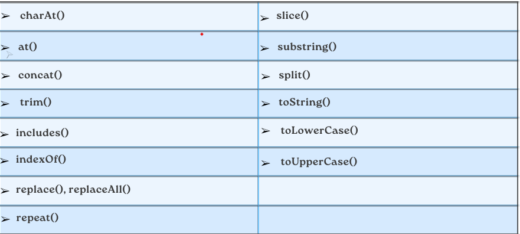

 

# `Что такой Charat() ?`
## Метод charAt() возвращает символ по указанному индексу (позиции) в строке и не принемает отритсателни число.
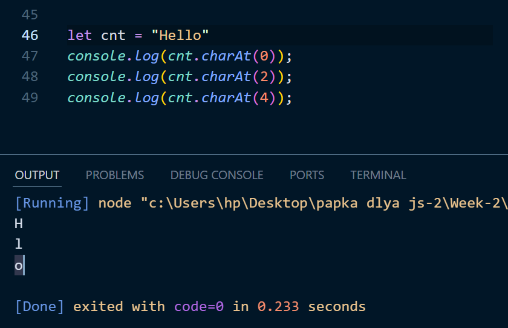
___
 

# `Что такой at() ?`
## Метод at() принимает целочисленное значение и возвращает новую строку. Этот метод допускает положительные и отрицательные целые числа. Отрицательная Целые числа отсчитывают от последнего символа строки.
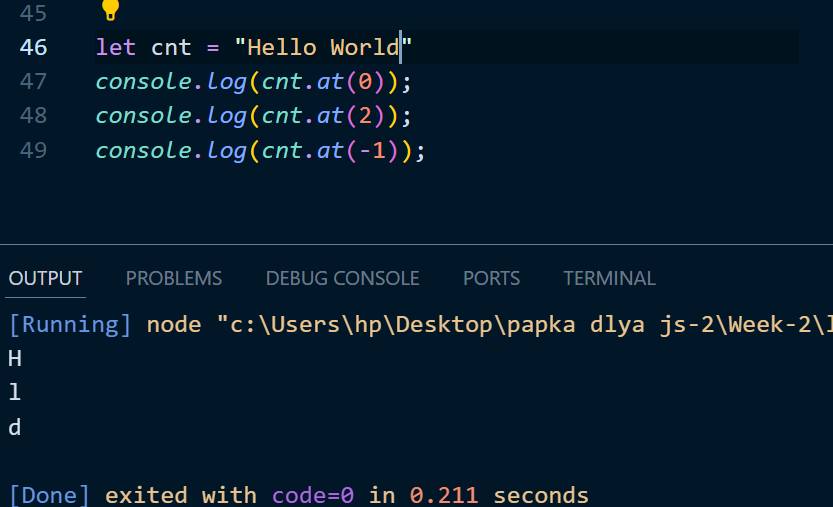
___
 

# `Что такой replece() ?`
## Метод replece() изменяет найдиную значение с другом значением и принимает 2 значение. 1 это что изминит. 2 значение изминение.

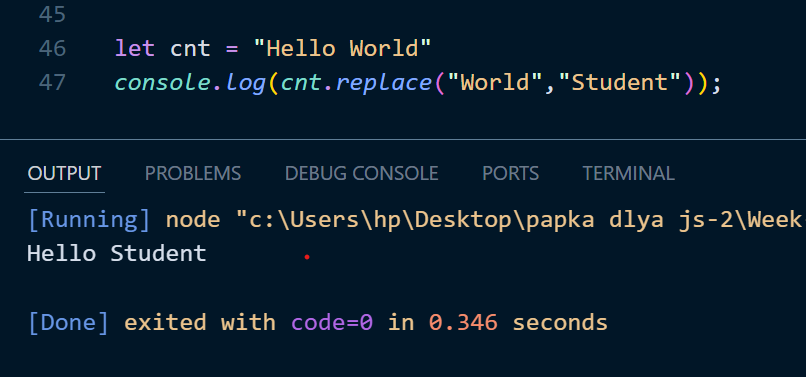
___
 

# `Что такой replaceAll() ?`
## Метод replaceAll() возвращает новую строку, в которой все совпадения с шаблоном заменяют сязаменой.

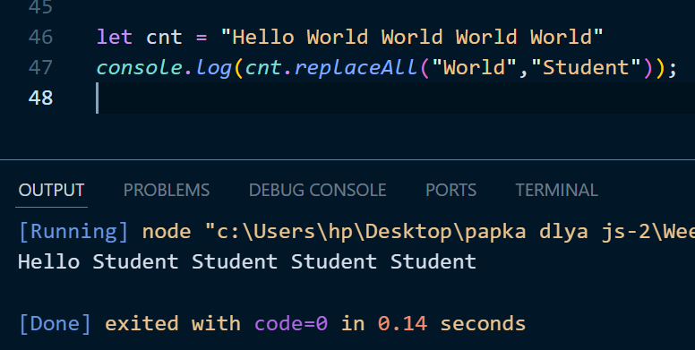

___
 

# `Что такой split() ?`
## Метод split() разбивает строку на массив подстрок. Метод split() возвращает новый массив. Метод split() не изменяет исходную строку. Если в качестве разделителя используется (" "), строка разделяется на слова.

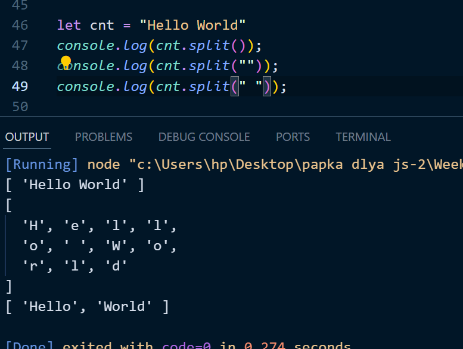

___

 

# `Что такой slice() ?`
## Метод slice() возвращает неполную копию части массива и строки в новый объект array, выбранный от начала до конца (end не включен), где start и end представляют индекс элементов в этом массиве.

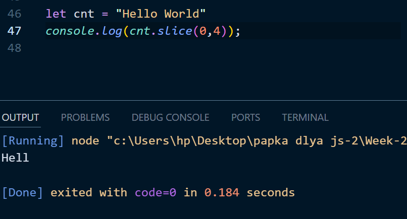

___ 

 

# `Что такой TolowerCase() ?`
## Метод toLowerCase() преобразует строку в строчные буквы. Метод toLowerCase() не изменяет исходную строку.

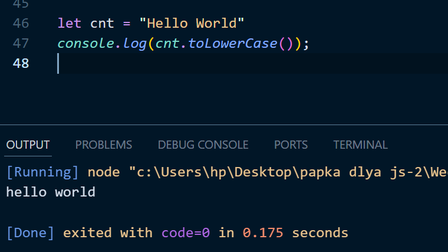

___

 

# `Что такой ToUpperCase() ?`
## Метод toUpperCase() преобразует строку в строчные буквы, используя этот языковой стандарт

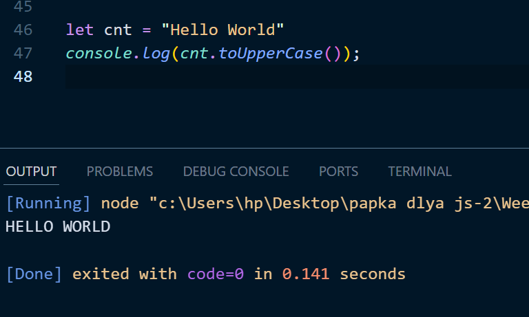

___

 

# `Что такой trim() ?`
## Метод trim() удаляет пробелы с обеих сторон предложений.

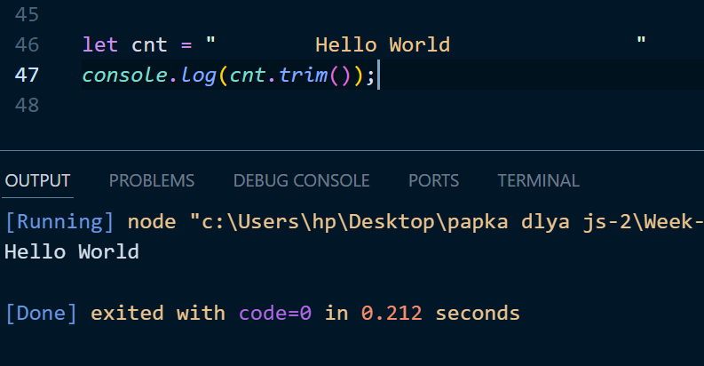

___

 

# `Что такой includes() ?`
## Метод includes() возвращает значение true, если строка содержит указанную строку. В противном случае он возвращает значение false. Метод includes() чувствителен к регистру.

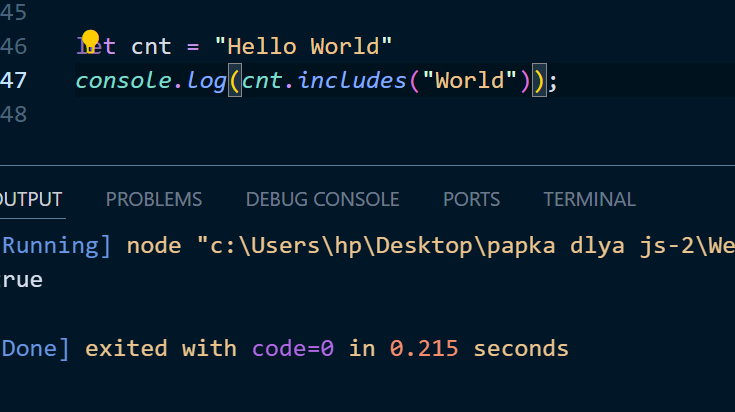

___

 

# `Что такой indexOf() ?`
## Sea Метод indexOf() возвращает позицию первого вхождения значения avalue в строке.rch

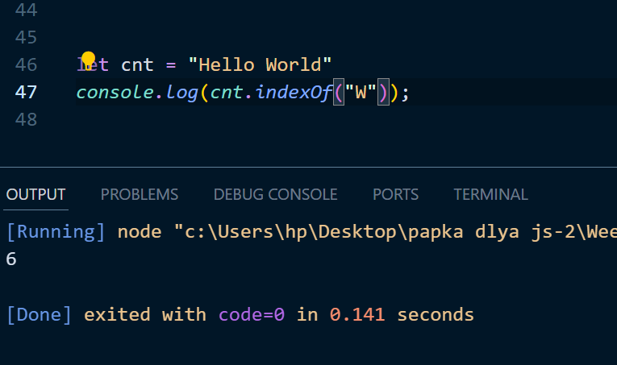

# `Что такой repeat() ?`
## Метод repeat() создает новую строку, повторяя заданную строку заданное количество раз, и возвращает ее.

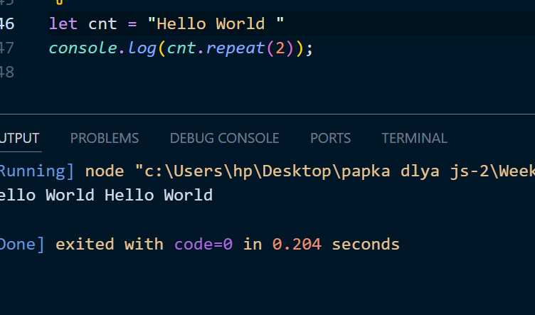

___

 

# `Число методов JavaScript`

# `Что такой Math.floor() ?`
## Функция Math.floor() округляет число в меньшую сторону до следующего наименьшего целого числа.
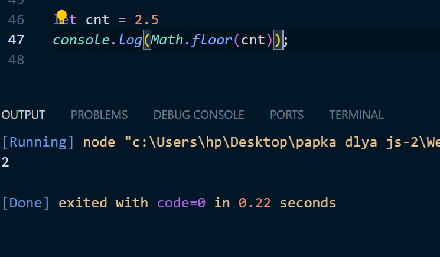

 

# `Что такой Math.round() ?`
## Функция Math.round() возвращает число, округленное до ближайшего целого.
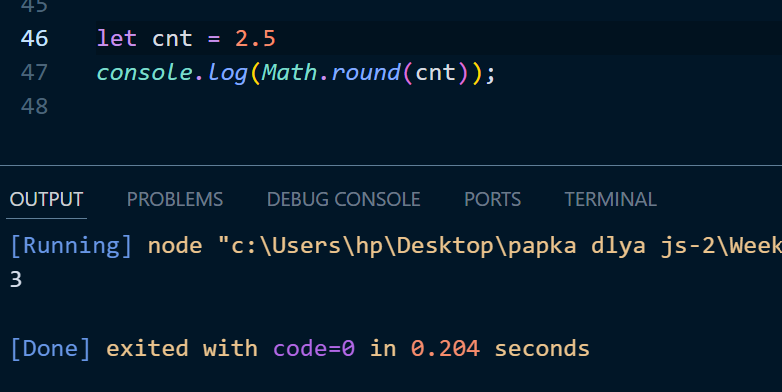

 

# `Что такой isNaN() ?`
## Функция isNaN() проверяет, является ли значение isNaN (не числом) или нет.
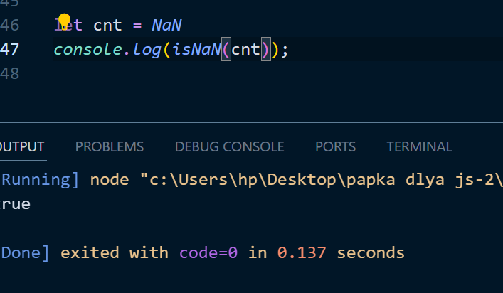

 

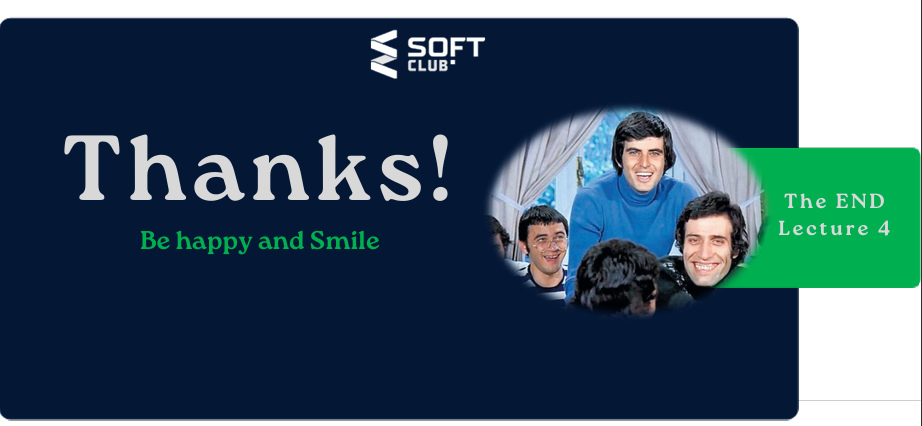
